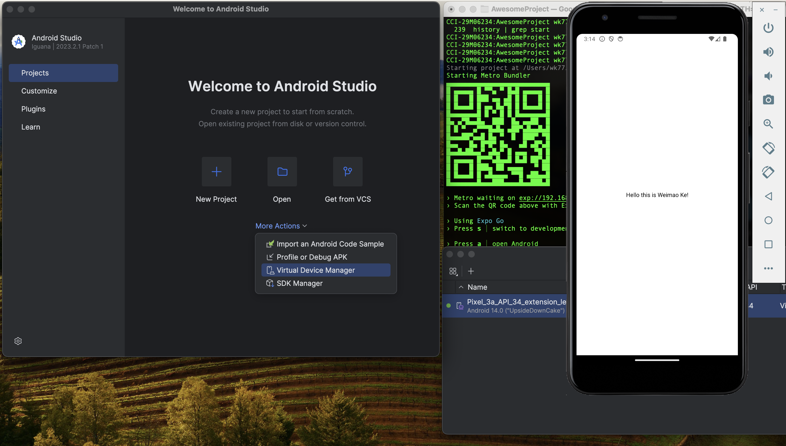

# INFO 670 Assignment 1 (5 points)

Additional information about each step can be found in Week 1 (in Reading/References and PDF Slides). 

## 1. Setup 

Follow class lecture (recording) to do software setup on your computer for React Native App development. Steps are outlined in `info670_week1_setup.pdf`. 

This PDF `react_native_setup_checklist.pdf` provides a checklist of software and packages you need. 

## 2. Create Github Repository

Follow instructions in `info670_week1_first_app_expo.pdf` to create a **public** Github repository (ONLY ONE repository is necessary for all your assignments) and clone it to your computer with your Github credential. 

## 3. Create First React Native App (Expo)

Instructions continue in `info670_week1_first_app_expo.pdf` for the creation of your first React Native App with Expo. 

## 4. Test Run

Additional instructions in `info670_week1_first_app_expo.pdf` to start the app with Expo Go. It can be tested on an Android emulator (in Android Studio's Virtual Device Manager) or on your phone (Android or iPhone with Expo Go app installed). 

## 5. Your Name on the App

Modify the code in `App.js` in the app source such that your full name appears on the first screen of the app. Rerun to test it and take a screenshot of the running app. 

## 6. README.md

Put the screenshot image in the project repository and include it in the README.md. For example: 

## 7. Committ and Push

Do the following to submit your changes to Github: 
1. Stage your changes
2. Committ the staged changes
3. Push Changes to Github

## Final Submission

Submit the link to **your Github repository** on blackboard, make sure you have the following: 

* [ ] A sub-directory with all code for your first app
* [ ] A `README.md` with the app screenshot (your name on it)

